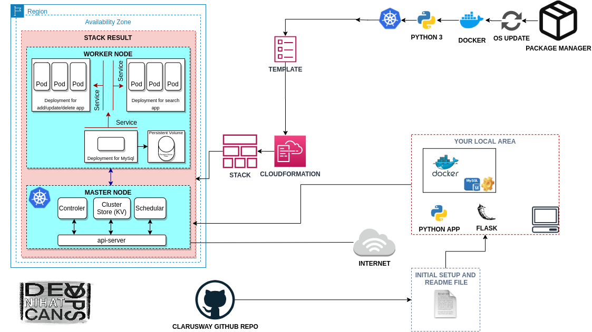
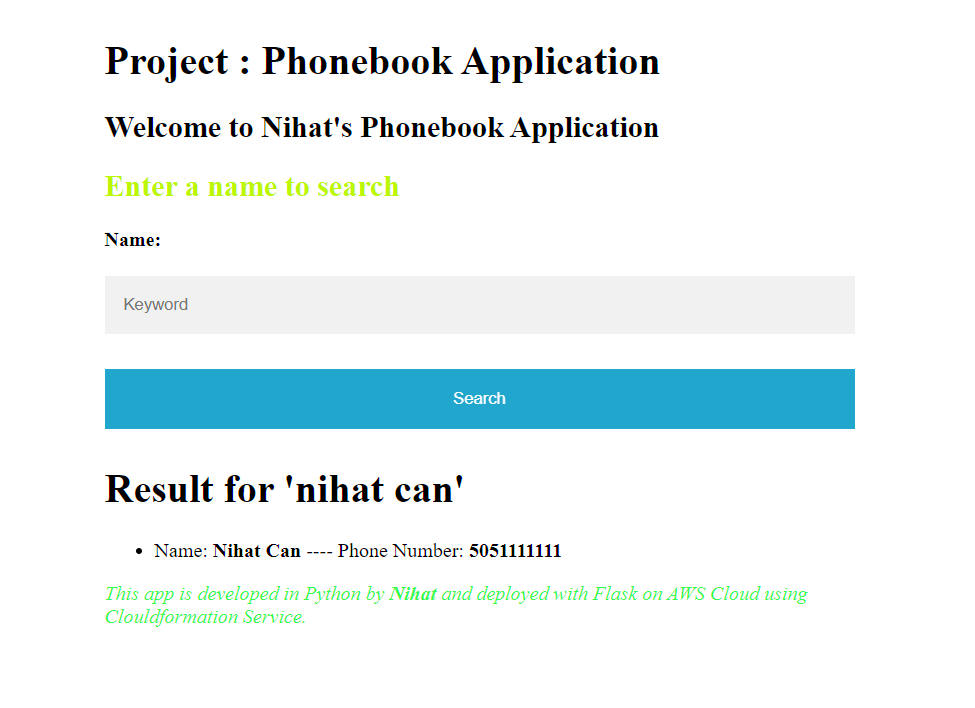
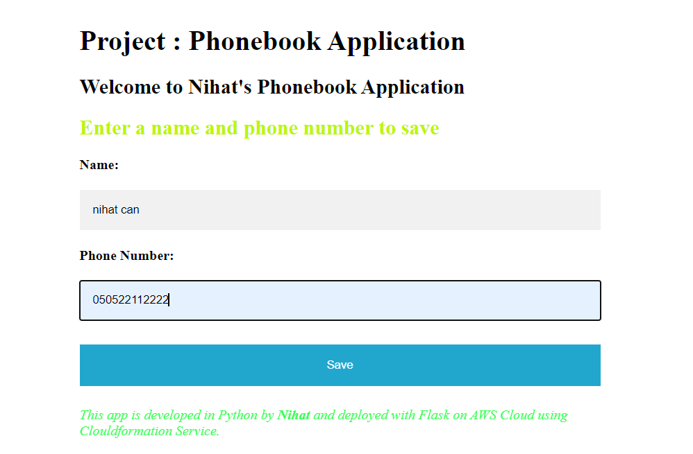
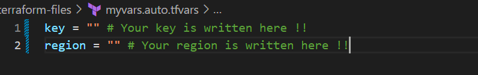

KUBERNETES PROJECT

Description: 

With this project, I aimed to create a web application with MySQL Database using Docker and Kubernetes. In this application, there are frontend service and a backend service to interact with database service. Kubernetes deployment manage both of the services. The backend service will be a gateway for the application, and it will serve the necessary web pages for create, delete and update operations while the frontend service will serve a search page in order to conduct for reading operations. To preserve the data in the database, persistent volume and persistent volume claim concepts adopted.

All you have to do is editing the terraform-files/myvars.auto.tfvars folder with your own values and running the "terraform apply" command inside the terraform-files folder. You will see the page on port 30001 and port 30002 in about 10 minutes.

WARNING This terraform files creates an Amazon EC2 instance.  There will be a payment due to AWS resource usage.

Road Map: 

Outcome:

Search page

Add page 

Delete page

Update page

NOTE: You must customize your variable in terraform-files/myvars.auto.tfvars file.

